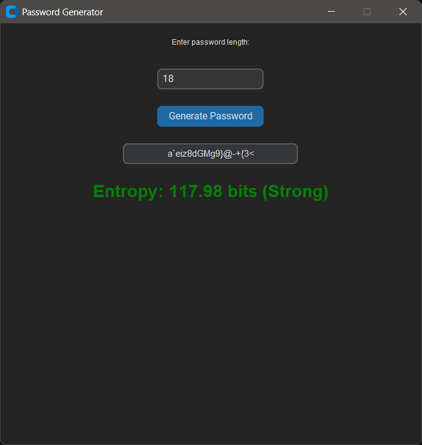

# Password Generator Application
project_week3_decodeLabs

A secure password generator desktop application built with Python, Tkinter, and CustomTkinter.

This application allows users to generate strong random passwords based on a custom length entered by the user. The generated password is analyzed using entropy calculations to determine its overall strength.

---

# Features

- Generate secure random passwords
- User-defined password length
- Password entropy calculation
- Password strength analysis
- Modern GUI using CustomTkinter
- Cryptographically secure generation using the `secrets` module
- Simple and user-friendly interface

---

# Screenshots

## Main GUI




---

# Technologies Used

- Python
- Tkinter
- CustomTkinter
- secrets module
- string module
- math module

---

# Installation

## Clone the repository

```bash
git clone https://github.com/Basantyaser/password_generator_app.git
